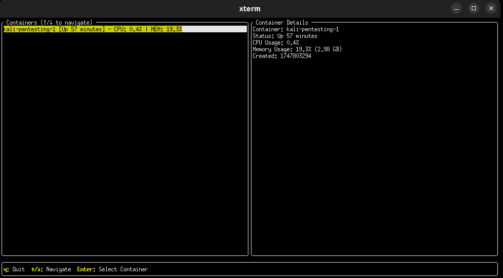

# Dockertop

A terminal-based Docker container monitoring tool written in Rust. Dockertop provides a real-time, interactive interface to monitor your Docker containers' resource usage and status.



## Features

- Real-time monitoring of Docker containers
- CPU usage tracking
- Memory usage and limits
- Container status monitoring
- Interactive terminal UI
- Keyboard navigation
- Detailed container information

## Prerequisites

- Rust (latest stable version)
- Docker daemon running
- Unix-like operating system (Linux/macOS)

## Installation

1. Clone the repository:
```bash
git clone https://github.com/lpolish/dockertop.git
cd dockertop
```

2. Build the project:
```bash
cargo build --release
```

3. Run the application:
```bash
./target/release/dockertop
```

## Usage

Once running, Dockertop provides an interactive interface with the following controls:

- `↑/↓` - Navigate between containers
- `Enter` - Select container for detailed view
- `q` - Quit the application

The interface is divided into two main sections:
- Left panel: List of all containers with basic stats
- Right panel: Detailed information about the selected container

## Building from Source

1. Ensure you have Rust installed:
```bash
curl --proto '=https' --tlsv1.2 -sSf https://sh.rustup.rs | sh
```

2. Clone and build:
```bash
git clone https://github.com/yourusername/dockertop.git
cd dockertop
cargo build --release
```

## Dependencies

- tui-rs - Terminal UI library
- crossterm - Terminal manipulation library
- bollard - Docker API client
- tokio - Async runtime
- sysinfo - System information gathering
- anyhow - Error handling
- thiserror - Error handling
- futures - Async utilities
- chrono - Time handling
- log - Logging
- env_logger - Logging implementation

## Contributing

Contributions are welcome! Please feel free to submit a Pull Request.

## License

This project is licensed under the MIT License - see the LICENSE file for details.

## Acknowledgments

- Inspired by tools like `htop` and `docker stats`
- Built with Rust's excellent ecosystem 